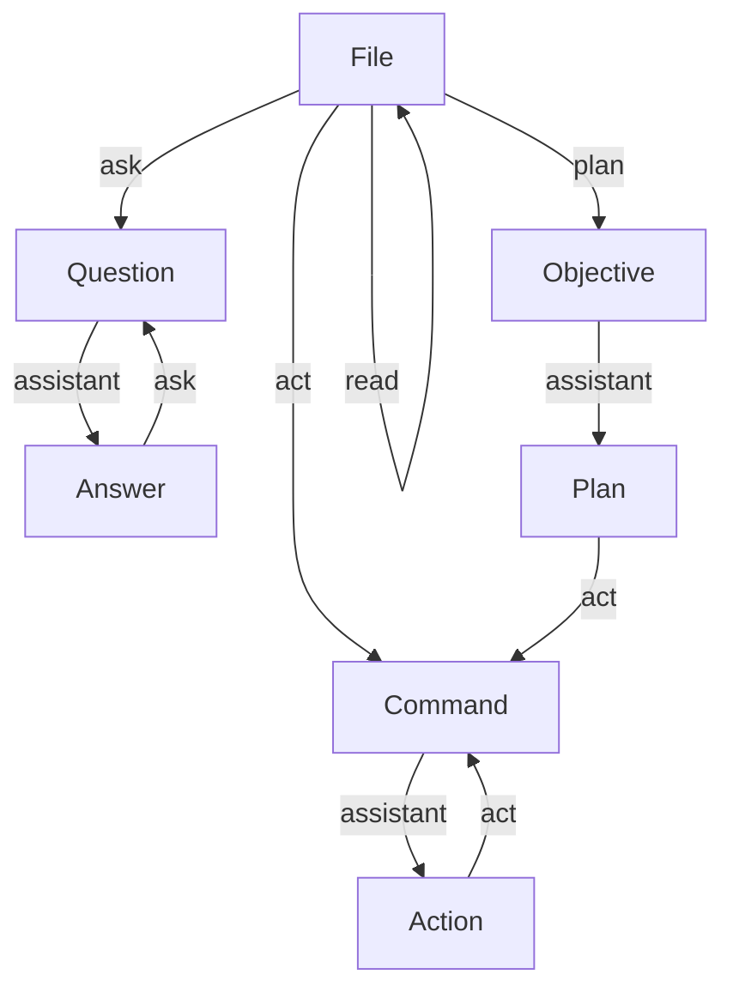

# YACT - Yet Another Coding Tool

A command-line AI assistant powered by Claude that helps you generate code, bash scripts, and answer questions about your codebase.

## Installation

Download the latest binary for your operating system from the [GitHub releases page](https://github.com/agabor/yact/releases).

Available binaries:
- Linux: `yact-linux-amd64`
- Windows: `yact-windows-amd64.exe`
- macOS: `yact-darwin-amd64` or `yact-darwin-arm64`

For example, to download and install on Linux:

```bash
cd /tmp
wget https://github.com/agabor/yact/releases/download/v0.0.0/yact-linux-amd64
chmod +x yact-linux-amd64
sudo mv yact-linux-amd64 /usr/local/bin/y
```

On macOS:

```bash
cd /tmp
curl -L -o yact-darwin-amd64 https://github.com/agabor/yact/releases/download/v0.0.0/yact-darwin-amd64
chmod +x yact-darwin-amd64
sudo mv yact-darwin-amd64 /usr/local/bin/y
```

On Windows, download the `yact-windows-amd64.exe` file and place it in a directory that's in your PATH, or run it directly from where you download it.

## Quick Start

Before using `y`, configure your Claude API key:

```bash
y config anthropic_api_key YOUR_API_KEY
```

You can verify your configuration at any time:

```bash
y config
```

## Commands

### Generate Code

Generate code files based on a prompt:

```bash
y act "create a user authentication handler"
```

The AI will generate complete files with code blocks. By default, files are written directly to your filesystem. Use the `--safe` flag to add a `.new` suffix to generated files for review before replacing originals:

```bash
y act --safe "add logging to the user service"
```

### Generate Bash Scripts

Generate standalone bash scripts:

```bash
y bash "create a script that backs up my database"
```

### Ask Questions

Ask questions about your codebase or general topics:

```bash
y ask "how does the authentication flow work?"
y ask "what are the best practices for Go error handling?"
```

### File References

Attach files to your prompts so the AI can reference them when generating code:

```bash
y read src/models/user.go
y read src/handlers/*.go
y ask "add validation to the user model"
```

Use glob patterns to match multiple files. View your current attachments:

```bash
y list
```

Clear all attachments:

```bash
y clear
```

### Context Management

By default, `y` maintains a conversation history. Use this to build on previous responses:

```bash
y ask "what functions do we need?"
y act "now implement those functions"  # The AI remembers the previous question
```

Start a fresh conversation:

```bash
y new
```

Retrieve the last AI response:

```bash
y last
```

## Configuration

View current settings:

```bash
y config
```

Set configuration values:

```bash
y config anthropic_api_key your_key_here
y config claude_model claude-opus-4-1-20250805
```

Available configuration keys:
- `anthropic_api_key` - Your Claude API key (required)
- `claude_model` - Which Claude model to use (default: claude-haiku-4-5-20251001)

## Piping Input

You can pipe text directly to `y`:

```bash
cat requirements.txt | y act
echo "fix the database connection" | y bash
```

## Usage Tips

- **File patterns**: Use glob patterns with `read` to attach multiple related files at once
- **Safe mode**: Always use `--safe` when generating new code to review changes first
- **Context**: Build up context by reading relevant files before asking complex questions
- **Conversation flow**: Use multi-step conversations - ask for a plan first, then generate code
- **Cost tracking**: The tool displays token usage and estimated costs for each API call

## Workflow

The following diagram illustrates YACT message types as nodes YACT commands as edges:



## Help

Display command reference:

```bash
y help
y --help
y -h
```

## Storage

Configuration and conversation history are stored in `~/.yact/`:
- `config` - Your API key and model settings
- `context.json` - Conversation history
- `attachments.json` - List of attached files

## Troubleshooting

**"Claude API key not configured"**
- Set your API key: `y config anthropic_api_key YOUR_KEY`

**"No files found matching pattern"**
- Check that the glob pattern matches existing files
- Use exact paths if glob patterns don't work

**"File not found in attachments"**
- Verify the file path is correct and the file exists
- Use `y list` to see currently attached files

**API errors**
- Verify your API key is valid
- Check your internet connection
- Ensure your Claude API account has available credits